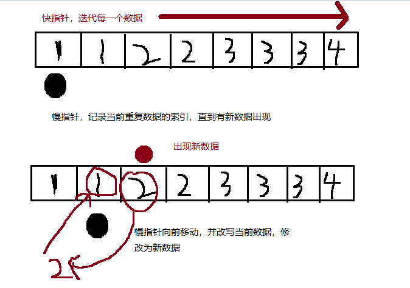

# 题目描述:
给定一个排序数组，你需要在原地删除重复出现的元素，使得每个元素只出现一次，返回移除后数组的新长度。

不要使用额外的数组空间，你必须在原地修改输入数组并在使用 O(1) 额外空间的条件下完成。

**示例 1:**

* 给定数组 nums = [1,1,2], 

* 函数应该返回新的长度 2, 并且原数组 nums 的前两个元素被修改为 1, 2。 

* 你不需要考虑数组中超出新长度后面的元素。

**示例 2:**

* 给定 nums = [0,0,1,1,1,2,2,3,3,4],

* 函数应该返回新的长度 5, 并且原数组 nums 的前五个元素被修改为 0, 1, 2, 3, 4。

* 你不需要考虑数组中超出新长度后面的元素。

--------------

## 两种解题思路：
farmer_solusion: 利用有序数组的特性，计算出数组中每个数重复的次数，依次删除，**缺点**：时间复杂度大，对数据的删除pop操作十分的耗时

normal_solusion: 迭代数组数据，定义两个数组下标，一个快，一个慢。当快指针迭代出新数据时，慢指针则前进一位，并改写此时的数组地址所指向的值，最后消除旧指针后数组内含多余的数据。(python中并没有指针这个概念，只有引用，这里意会就好)

